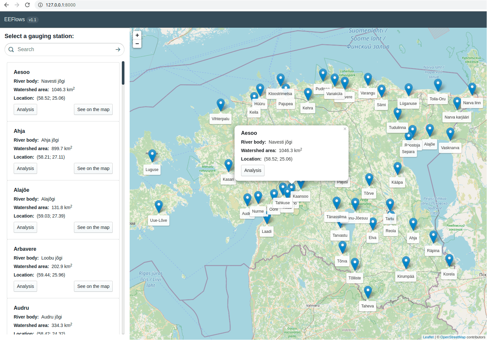
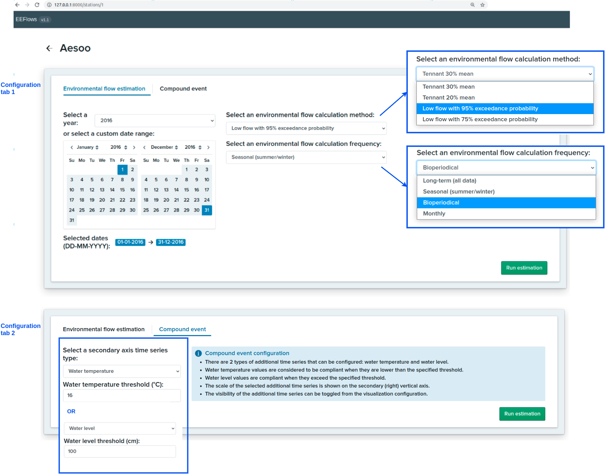
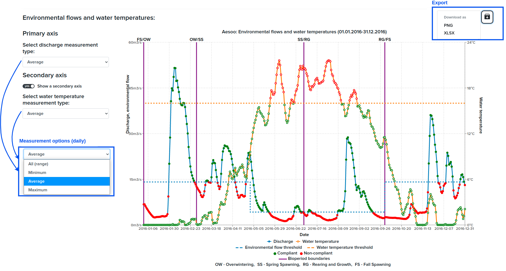
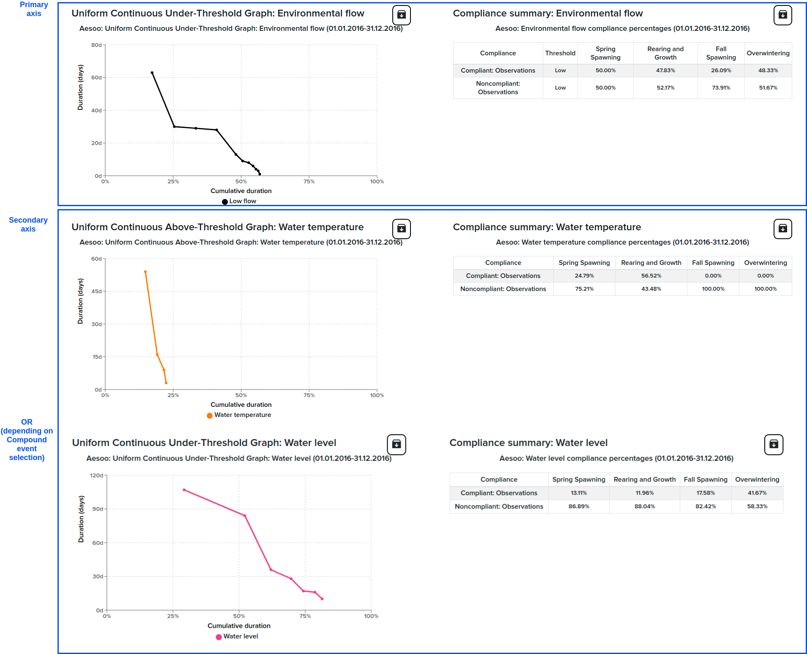
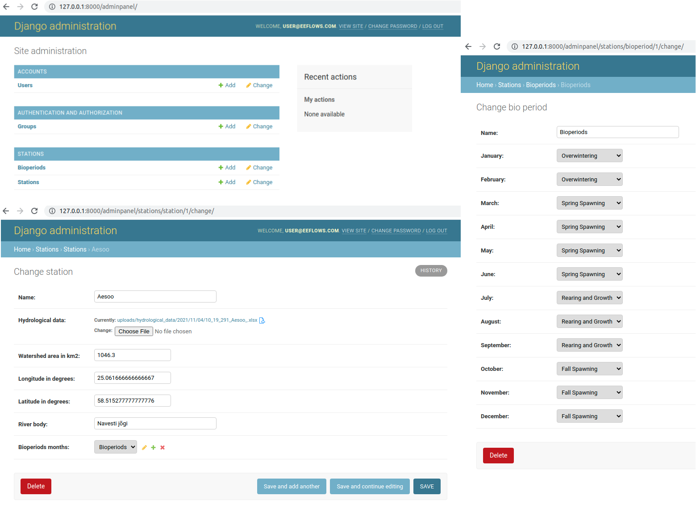

# EEFlows

 - Python:  3.8
 - DB:      PostgreSQL 12
 - Node:    12
 - React:   16.8+

Browser support is defined in the `eeflows/browserslist` file that is used for autoprefixing CSS.


## Software description

EEFlows is a Django/React web application implementing methods of environmental flows estimation and 
interpreting results of the estimation. In the simplest case, environmental flows define the minimum amount of water 
needed for aquatic ecosystems and are used as compliance thresholds (good ecological status or not) in environmental 
directives and regulations such as Water Framework Directive.

For demonstration, the application uses river data (daily time series of discharges (flow rates), water levels and 
water temperatures) from Estonian gauging stations. Daily average discharges (flow rates) and water levels are available
as open data on the [Estonian weather web-service](https://www.ilmateenistus.ee/siseveed/ajaloolised-vaatlusandmed/vooluhulgad/).
The extended datasets from the same locations are obtained on request from the government and can be viewed in the 
`eeflows/static/measurements/` directory of this repository.

To run the project, clone the code and proceed with the instructions in the *Setting up development* and 
*Running development server* sections.

### Main views

After setting up and running the project, check out port 8000 on localhost: http://127.0.0.1:8000/ in your browser.

#### Map view

The main view is a map with locations of Estonian river gauging stations.



On the map view, gauging stations can searched by the gauging station or river name. They can be selected on the map by
clicking on a blue marker, or by clicking on the *See on the map* button. To view river data from the selected gauging
station, click on the corresponding *Analysis* button.

#### Analysis view

Analysis view has the following URL: `http://127.0.0.1:8000/stations/<station_id>`.

Analysis view consists of the environmental flows estimation configuration panel and results (plots and tables). 
The application allows for the environmental flows estimation using hydrological methods (that use river discharge data) 
as well as compound event estimation (using other river data and a user-defined threshold to determine exceedance).

Configuration panel includes 2 tabs: *Environmental flow estimation* and *Compound event*:



Configuration panel defines parameters for environmental flows estimation that is carried out on the backend (Django)
side. These are a date range, method (formula) for calculation and frequency (whether a formula should be applied for
all the data, per summer/winter, bioperiod, month separately). Months of bioperiods are configured in the database (see
*Access to database entries, administration panel and data formats* section).

*Compound event* tab allows for selecting additional time series and a threshold to estimate exceedance. The available 
time series are water temperatures and water levels.

Results are estimated after clicking a *Run estimation* button. This will send the selected parameters to the backend 
(Django) service and return the results that are interpreted below the configuration panel.

**NB**: not all the datasets are complete, for some configuration parameters there can be missing data for certain 
dates, time series or measurement types.

The first generated plot is a compliance time series plot. It interprets the discharge daily data (for the selected 
time period) and calculated environmental flows thresholds (depending on the selected method and parameters) on the 
primary axis and the other selected times series (water temperatures or water levels) for the compound event estimation. 
Compliance is defined by the exceedance of the calculated environmental flow (for discharge - non-compliance if below 
threshold) or user-defined threshold (for water temperatures - non-compliance if above threshold and for water levels - 
non-compliance if below threshold).

Depending on the availability of data, there are different options of measurements to be visualised: daily minimum, 
average, maximum values or ranges. The visibility of the secondary axis time series can be toggled.



The results are also interpreted as Uniform-Continuous-Under(or Above)-Threshold (UCUT or UCAT) plots and compliance
summary tables. 

The UCUT and UCAT plots show the number of days of non-compliance ***in a row*** (Y-axis) starting from the
maximum number of days of non-compliance and the cumulative duration as a cumulative percentage from the whole period 
(e.g. if the selected date period is 1 year, then 1 year is 100%) - on X-axis.

Compliance summary tables show overall percentages of days of compliance and non-compliance per each bioperiod.



All the visualisations can be exported as PNG images, and their data can be downloaded as Excel files (by clicking and 
selecting an option in the Export dropdown).

#### References

The implemented environmental flows calculation methods and plots are described in the following paper:

*Reihan, A., Loigu, E. (2010). Ökoloogilise miinimumvooluhulga arvutusmetoodika
väljatöötamine. Töövõtuleping 18-25/185, Tallinn.* ([available in Estonian](https://old.envir.ee/sites/default/files/okominvooluhulgaarvutusmetoodikavtootamine.koondaruanne.pdf))

Bioperiods and visualisations are also inspired by the following paper:

*Parasiewicz, P., Prus, P., Suska, K., Marcinkowski, P. (2018). “E = mc2” of Environmental Flows: A Conceptual 
Framework for Establishing a Fish-Biological Foundation for a Regionally Applicable Environmental Low-Flow Formula. 
Water, 10(11), 1501. doi:10.3390/w10111501*


### Access to database entries, administration panel and data formats

Modification of station data can be done through Django administration panel. 

On localhost, it is available from http://127.0.0.1:8000/adminpanel/.

On installation, one superuser is pre-created for testing purposes, use the following credentials: 

    email: user@eeflows.com
    password: test

After authorisation, the administration panel allows for viewing, modifying and removing the existing data, 
adding new data to the database. The main database entities are *Stations* and *Bioperiod*. 

*Station* entity includes station name, parameters of its location, river body, used bioperiods object, watershed area,
and hydrological data - Excel file with time series data, see the format of files in the `eeflows/static/measurements/` 
directory.

*Bioperiod* entity involves mapping of months to one of 4 bioperiods: Overwintering, Spring Spawning, Rearing and 
Growth and Fall Spawning. Bioperiods are used for calculations, if the selected environmental flows calculation 
frequency is `Bioperiodical`.

The database is populated on project installation (see scripts in `eeflows/stations/migrations/`). The metadata of 
stations and used river data files is included in the `eeflows/static/Stations_Metadata.xlsx` file.



User accounts are also managed from the administration panel (for this, enter *Accounts/Users*).

## Setting up development

### Installing Docker and Docker Compose

Refer to original [Docker documentation](https://docs.docker.com/engine/installation/) for installing Docker.

After installing Docker you need to install [Docker Compose](https://docs.docker.com/compose/install/) to run
 multi-container Docker applications (such as ours).

To run Docker commands without `sudo`, you also need to
[create a Docker group and add your user to it](https://docs.docker.com/engine/installation/linux/ubuntulinux/#/create-a-docker-group).

### Setting up eeflows

Enter the directory of the cloned repository (`eeflows/`) containing `Makefile`. 

The easy way is to use [make](https://www.gnu.org/software/make/) to set up everything automatically:

    make setup

This command:

- copies the Pycharm project directory (useful for those who uses Pycharm as IDE)
- creates a local settings file from local.py.example (see *NB2*, just write out file as it is and proceed)
- builds Docker images
- sets up database and runs Django migrations (populating the database with river data)

Refer to `Makefile` to see what actually happens. You can then use the same commands to set everything up manually.

After that, to run the application, run

    make docker

*NB1*: Avoid directory names with spaces (for parent directories of the cloned repository directory) - this might cause 
problems while copying files on setup.

*NB2*: modifications in the `local.py` configuration file on setup are optional, in the general case, the 
application should work with the `local.py` as it is provided.


## Running development server

Both docker and docker-compose are used to run this project, so the run command is quite straightforward.

    docker-compose up

This builds, (re)creates and starts containers for Django, Node, PostgreSQL and Redis. Refer to `docker-compose.yml` for
more insight. Django app is running on `3000` port. Front-end server is running on `8000` port.
For more information see [SPA docs](app/README.md).

Logs from all running containers are shown in the terminal. To run in "detached mode", pass the `-d` flag to
docker-compose. To see running containers, use `docker-compose ps`. To see logs from these containers, run
`docker-compose logs`.

To _stop_ all running containers, use

    docker-compose stop

This stops running containers without removing them. The same containers can be started again with
`docker-compose start`. To stop a single container, pass the name as an extra argument, e.g.
`docker-compose stop django`.

To _stop and remove_ containers, run

    docker-compose down

This stops all running containers and removes containers, networks, volumes and images created by `up`.

### Using a different configuration file

By default docker-compose uses the `docker-compose.yml` file in the current directory. To use other configuration files,
e.g. production configuration, specify the file to use with the `-f` flag.

    docker-compose -f docker-compose.production.yml up

## Running Django commands in Docker

    docker-compose run django python manage.py <command>

### Command shortcuts in the Makefile

|Action                                |Makefile shortcut                      |Actual command                                                              |
|:-------------------------------------|:--------------------------------------|:---------------------------------------------------------------------------|
|Installing Python packages            |`make poetry-install cmd=<package>`    |Runs `poetry install $(cmd)` in its own container                           |
|(Re)Generate poetry.lock              |`make poetry-lock`                     |Runs `poetry lock -v` in its own container                                  |
|Check Python package security warnings|`make poetry-check`                    |`docker-compose run --rm --workdir / django poetry check`                   |
|make migrations                       |`make makemigrations cmd=<command>`    |`docker-compose run --rm django ./manage.py makemigrations $(cmd)`          |
|migrating                             |`make migrate cmd=<command>`           |`docker-compose run --rm django ./manage.py migrate $(cmd)`                 |
|manage.py commands                    |`make docker-manage cmd=<command>`     |`docker-compose run --rm django ./manage.py $(cmd)`                         |
|any command in Django container       |`make docker-django cmd=<command>`     |`docker-compose run --rm django $(cmd)`                                     |
|run tests                             |`make test`                            |`docker-compose run --rm django py.test`                                    |
|run linters                           |`make quality`                         |                                                                            |
|run StyleLint                         |`make stylelint`                       |`docker-compose run --rm node yarn stylelint`                               |
|run ESLint                            |`make eslint`                          |`docker-compose run --rm node yarn lint`                                    |
|run Prospector                        |`make prospector`                      |`docker-compose run --rm django prospector`                                 |
|run isort                             |`make isort`                           |`docker-compose run --rm django isort --recursive --check-only -p . --diff` |
|run psql                              |`make psql`                            |`docker-compose exec postgres psql --user eeflows --dbname eeflows` |


## Installing new python or npm packages

### Node
Since `yarn` is inside the container, currently the easiest way to install new packages is to add them
to the `package.json` file and rebuild the container.

#### Gotchas

* Keep `react`, `react-dom` and `react-testing-library` node package versions in sync. Otherwise it causes an error when running `jest`.

### Python

Python package management is handled by `poetry`, and employs a lock file (`poetry.lock`) to store the package version information.
The lock file ensures that when we are building production images
we don't install conflicting packages and everything is resolved to matching version while developing.

To install a new Python package, there are two options.
* Edit the `pyproject.toml` file and add the required package there, then run `make poetry-lock` to regenerate the lock file.
* Or run `make poetry-install cmd=<package>` -- this will add the package to `pyproject.toml` and regenerate `poetry.lock` in one take.

#### Using poetry locally for pycharm

PyCharm, as of 2020.3, does not yet support locating Poetry virtualenvs out of the box. So you need to do it manually.

* run `poetry install` locally. Given, that you have poetry installed.
* When you ran previous command, it told you where it created the virtual environment something like 
  `/home/you/.cache/pypoetry/virtualenvs/projectname-somehash`;
* if you missed it you can see it by running `poetry run which python`. It should be something like 
  `/home/you/.cache/pypoetry/virtualenvs/bin/python`;
* Open your project in pycharm and under settings search for _project interpreter_ or just _interpreter_.
  Select the python interpreter located as shown above.

## Rebuilding Docker images

To rebuild the images run `docker-compose build`. This builds images for all containers specified in the configuration
file.

To rebuild a single image, add the container name as extra argument, e.g. `docker-compose build node`.

## Swapping between branches

After changing to a different branch, run `docker-compose up --build`. This builds the images before starting
containers.

If you switch between multiple branches that you have already built once, but haven't actually changed any configuration
(e.g. installed new pip or npm packages), Docker finds the necessary steps from its cache and doesn't actually build
anything.

## Running tests

You can also use `--reuse-db` or `--nomigrations` flags to the actual command above to speed things up a bit. See also:
https://pytest-django.readthedocs.org/en/latest/index.html


### Coverage

You can also calculate tests coverage via `make coverage`. The results will be in the following directories:

- python: [`eeflows/cover`](./eeflows/cover)
- javascript: [`app/coverage`](./app/coverage)

## Running code formatting tools

Code formatting tools are used to use same code style across the project.

For JavaScript we use Prettier.
```bash
# To check Javascript code style use:
make prettier-check-all

# To check single Javascript file use:
make prettier-check cmd="app/src/index.js" # File path should be relative to project root

# To format Javascript code use:
make prettier-format-all

# To format single Javascript file use:
make prettier-format cmd="app/src/index.js" # File path should be relative to project root
```

For Python we use Black formatter.
```bash
# To check Python code style use:
make black-check-all

# To check single Python file use:
make black-check cmd="test_project/accounts/admin.py" # File path should be relative to project root

# To format Python code use:
make black-format-all

# To format single Python file use:
make black-format cmd="app/src/index.js" # File path should be relative to project root
```

There is also option to use file watchers.
To use pre-built docker helpers for this, import `.idea_template/watchers.xml`.

You can also use `prettier` and `black` directly if NodeJS and/or Python is available for you.


## Running linters

Linters check your code for common problems. Running them is a good idea before submitting pull requests, to ensure you
don't introduce problems to the codebase.

We use _ESLint_ (for JavaScript parts), _Prospector_ (for Python), _StyleLint_ (for SCSS), _isort_ (for Python imports)
and _Pipenv check_ (for security vulnerabilities).

To use them, run those commands in the Django app dir:

    # Check Javascript sources with ESLint:
    make eslint
    # Check SCSS sources with StyleLint:
    make stylelint
    # Check Python sources with Prospector:
    make prospector
    # Check Python imports with isort:
    make isort
    # Check Python package security vulnerabilities:
    make poetry-check
    # Run all of above:
    make quality


## Running tests

Tests are ran by `pytest` and `jest` test runners for python and javascript respectively. They can be run with the
makefile via `make test`.


## Django translations

Project contains two commands for updating and compiling translations. Those two are `make makemessages` and `make compilemessages`.
Howewer if you are adding a new language or are creating translations for the first time after setting up project, you need to run
different command to create the initial locale files. The command is `add-locale`. After you have used this command once per each
new language you can safely use `makemessages` and `compilemessages`


## SPA translations

Frontend app uses [i18next](https://github.com/i18next/i18next) for translations and locale data is stored in `public/locale/**/translations.json`.
Translation discovery is handled in runtime and with command `extract-i18n`. During runtime discovered translations
will be put in `translations.missing.json`, This file can be referred to for new translations added.
**Notice: Only used translations will be automatically discovered. Other usages require manual extraction.**
To add extra language, add it to `i18n.json` and run `make extract-i18n`. This will generate required files.
In development Node server needs to be restarted to see updated translations.
